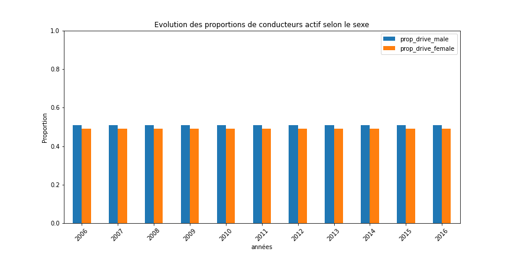

# Exploration des données de sécurité routière

**RAF**

- [ ] étudier les proportions H/F en temps de conduite

---
**chapô**

---

**Sommaire**

1. [Méthodologie](#mthodologie)
   1. [Origine des données](#origine-des-donnes)
   1. [Outils utilisés](#outils-utiliss)
   1. [Notions utilisés](#notions-utiliss)
1. [Vue d'ensemble en quelques chiffres ](#vue-densemble-en-quelques-chiffres)
1. [Homme au volant, mort au tournant](#homme-au-volant-mort-au-tournant)
1. [Influence de l'âge du conducteur](#influence-de-lge-du-conducteur)
1. [Saisonnalité selon l'heure et la date](#saisonnalit-selon-lheure-et-la-date)
1. [Des types de trajets plus ou moins dangereux](#des-types-de-trajets-plus-ou-moins-dangereux)
1. [Toutes les routes ne se valent pas](#toutes-les-routes-ne-se-valent-pas)

## Méthodologie

### Origine des données

### Outils utilisés

### Notions utilisés

#### Gravité d'un accident

On définit la gravité d'un accident comme l'état du blessé le plus grave. Par exemple, 

- un accident avec 2 blessés léger et un mort est considéré comme un **accident mortel**
- un accident avec que des blessés léger est un **accident léger**
- enfin, un **accident grave** fait au moins un blessé grave (mais pas de mort)

## Vue d'ensemble en quelques chiffres 

Environ **3500** personnes meurent sur les routes chaque année.
Ce nombre reste relativement stable sur les 4 dernières années.

## Homme au volant, mort au tournant

*<<Femme au volant, mort au tournant>>*

C'est l'occasion de vérifier si c'est vrai ! Pour cela, on va se baser sur la liste de tous les conducteurs impliqué
dans un accident. On ne s'intéresse pas ici à la responsabilité du conducteur. Et de toute façon, cette information
n'est pas disponible dans nos jeux de données.

Pour chaque conducteur impliqué dans un accident, on note :

- son sex
- [la gravité de l'accident](#gravit-dun-accident)

Ensuite, il ne nous reste qu'à compter le nombre d'accidents pour les hommes et pour les femmes, selon leur gravité.
Ce qui nous donne ce graphique :

**On constate donc que les femmes sont beaucoup moins impliquée dans des accidents que les hommes**

Une explication possible serait qu'elles conduisent moins que les hommes, en nombre de conducteurs et en temps 
de conduite.

Pour savoir si c'est le nombre de conductrices qui est en cause, on compare ces proportions d'implication dans des
accidents à la proportion estimée de conducteurs selon le sexe.
La colonne *Prop. conducteurs* correspond à la proportion (estimée) de conducteurs actifs hommes et femmes. On entend 
par conducteur actif une personne :

- ayant plus de 18 ans
- ayant le permis
- conduisant un véhicule au minimum de manière occasionnelle

On peut d'ailleurs estimer le nombre de conducteurs actifs dans la population au fil des ans :

Ce graphique a été obtenu en récupérant, pour chaque année, le nombre de personnes (par sex) de plus de 20 ans. Cette
donnée provient du recensement annuel de la population. La tranche d'age > 18 ans n'étant pas disponible, il s'agit 
d'une estimation.
On pondère ensuite ce nombre par la proportion de conducteur actifs, estimée par le sondage sur les modes de transport 
de 2008.

La différence entre proportion de conductrices et proportion d'implication dans des accidents chez les femmes 
est trop marquée.
**La différence entre les sexes ne vient donc pas du nombre de conducteurs.**

Une deuxième explication pourrait être que les hommes passent en moyenne plus d'heure sur les routes que les femmes.
Si tel est le cas (dans les mêmes proportions que l'implication dans des accidents), ce seul fait pourra expliquer 
les différences hommes / femmes au niveau des accidents. 

// TOOD étudier les proportions H/F en temps de conduite

## Influence de l'âge du conducteur

## Saisonnalité selon l'heure et la date

## Des types de trajets plus ou moins dangereux

## Toutes les routes ne se valent pas

